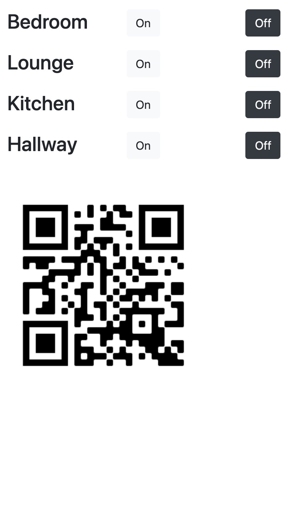

# Nodejs Lighting API

Phone -----> RaspberryPi (API) -----> Lutron

## Goals

- Provide an easier way to control lighting, than the Connect+ app.
  - End goal, have a UI that can control the lights from phone
    - Ideas:
      - Hack the lutron config xml file to customise it
      - Build an node.js api and plug into a simple UI
        - [x] list the various cmmands needed to send over telnet
        - [x] figure out how to run a small telnet scipt to send commands
        - [x] connect command scripts to express api
        - [x] build the ui

## PWA App UI

### Room ID's

- Lounge - 14
- Kitchen - 13
- Bedroom - 16

## Alternatives

- Other open-source projects exist that may be able to connect to Apple Homekit
  - OpenHab
